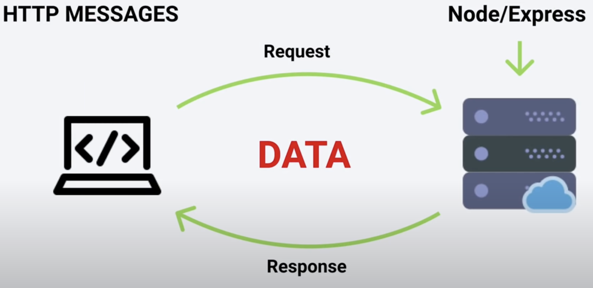
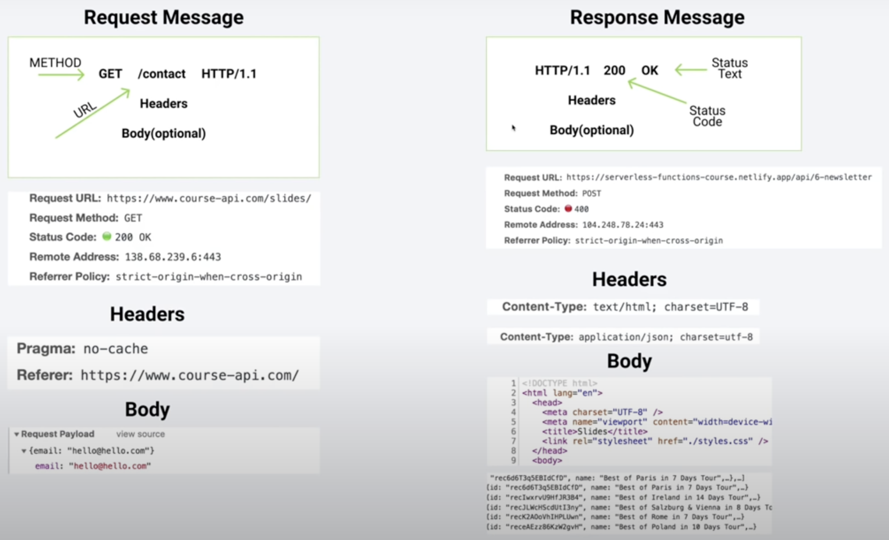

# Node.js Tutorial

## What is Node.js

A platform allow us to run JavaScript on Computer or Server.

- Read, Delete, Upload Files
- Easy Communicate with Database
- Build on Chrome V8 Engine
- Huge Ecosystem with Thousands of Open Source Modules (Packages)
- Perfect for real-time service ( Chat , Video Streaming, 2D Gaming)
- Job Vacancies

## What is V8 Engine

V8 engine ဆိုတာ C++ နဲ့ ရေးထားတဲ့ chrome မှာ အသုံးပြုတဲ့ javascript engine တစ်ခုပဲ ဖြစ်ပါတယ်။

- Computer Doesn't understand JavaScript
- JS Engine make Computer Understand JS
- V8 is heart of Node.js
- Node.js embedded V8 inside

### How does working JavaScript Engine

JavaScript engine သည် JavaScript code ကို run တဲ့ အချိန်မှာ C++ က JavaScript Code တွေကို ယူပြီးတော့ Assembly Code
ပြောင်းပေးတယ်။ ထို့နောက် Assembly code တွေကို Computer တွေနားလည်တဲ့ Machine Code ကိုပြောင်းပေးပါတယ်။

## Browser vs Node.js

| Browser                 | Node.js                 |
|-------------------------|-------------------------|
| DOM                     | No DOM                  |
| Window                  | No Window               |
| Interactive Application | Server Side Application |
| No Filesystem           | Filesystem              |
| Fragmentation           | Version                 |
| ES6 Module              | CommonJS                |

## GLOBALS - NO WINDOW

global variables are anywhere in your application you can access them so no matter how complex my application gets. How
nested it gets or whatever. I'll always have access to those variables and again let me repeat these are just some of
the variables.

| Global Variables | Description                                        |
|:-----------------|:---------------------------------------------------|
| \_\_dirname      | path to current directory                          |
| \_\_filename     | file name                                          |
| require          | function to use module (CommonJS)                  |
| module           | info about current module (file)                   |
| process          | info about env where the program is being executed |

## Module

### Export Module

- [4-name.js](01-node-tutorial/04-names.js)

```javascript
// local
const secret = "SUPER SECRET";
// share
const john = "john";
const peter = "peter";

module.exports = {john, peter};
```

- [05-utils.js](01-node-tutorial/05-utils.js)

```javascript
const sayHi = (name) => {
  console.log(`Hello there ${name}`);
};

module.exports = sayHi;
```

### Import Module

- [03-modules.js](01-node-tutorial/03-modules.js)

```javascript
const names = require("./04-names");
const sayHi = require("./05-utils");

sayHi("susan");
sayHi(names.john);
sayHi(names.peter);
```

## Build-in Modules

- OS (Operating System Module)
- PATH (Path Module)
- FS (File System Module)
- HTTP (Http Module)

### OS (Operating System Module)

1. Information about current user

    ```javascript
    const os = require("os");
    const user = os.userInfo();
    console.log(user);
    ```

    - result

    ```text
    {
        uid: 501,
        gid: 20,
        username: 'zen',
        homedir: '/Users/zen',
        shell: '/bin/zsh'
    }
    ```

2. Method returns the system uptime in seconds

    ```javascript
    const os = require("os");
    console.log(`The System uptime is ${os.uptime()} seconds`);
    ```

    - result

    ```text
    The System uptime is 534174 seconds
    ```

3. Other OS modules

    ```javascript
    const os = require("os");
    const currentOS = {
      name: os.type(),
      release: os.release(),
      totalMemory: os.totalmem(),
      freeMemory: os.freemem(),
    };
    
    console.log(currentOS);
    ```

    - result

    ```text
    {
       name: 'Darwin',
       release: '23.1.0',
       totalMemory: 8589934592,
       freeMemory: 36913152
    }
    ```

### Path Module

1. Provides the platform-specific path segment separator

    ```javascript
    const path = require("path");
    console.log(path.sep);
    ```

    - result

    ```text
    /
    ```

2. The path.join() method joins all given path segments together using the platform-specific separator as a delimiter,
   then normalizes the resulting path.

    ```javascript
    const path = require("path");
    const filePath = path.join("/content", "subfolder", "test.txt");
    console.log(filePath);
    ```

    - result

    ```text
    /content/subfolder/test.txt
    ```

3. The path.basename() method returns the last portion of a path

   ```javascript
   const path = require("path");
   const filePath = path.join("/content", "subfolder", "test.txt");
   const base = path.basename(filePath);
   console.log(base);
   ```

    - result

   ```text
   test.txt
   ```

4. The path.resolve() method resolves a sequence of paths or path segments into an absolute path.

   ```javascript
   const path = require("path");
   const absolute = path.resolve(__dirname, "content", "subfolder", "test.txt");
   console.log(absolute);
   ```

    - result

   ```text
   /Users/zen/Development/Tutorial/Backend/FreeCodeCamp/content/subfolder/test.txt
   ```

### Fs Module (Sync)

- Read File Synchronously ( return string or buffer )

  ```javascript
  readFileSync(path, options);
  ```

  ```javascript
  const { readFileSync } = require("fs");

  const first = readFileSync("./content/first.txt", "utf-8");
  const second = readFileSync("./content/second.txt", "utf-8");
  console.log(first, second);
  ```

    - result

  ```text
  Hello this is first text file Hello this is second text file
  ```

- Write File Synchronously

    ```javascript
    writeFielSync(path, data, options);
    ```

    ```javascript
    const {writeFileSync} = require("fs");
    
    writeFileSync(
      "./content/result-sync.txt",
      `Here is the result : ${first}, ${second}`,
      {flag: "a"}
    );
    ```

### Fs Module (Async)

- Read File Asynchronously ( return string or buffer )

    ```javascript
    readFile(path, options, callback(err, data));
    ```

    ```javascript
    const {readFile, writeFile} = require("fs");
    
    readFile("./content/first.txt", "utf-8", (err, result) => {
      if (err) {
        console.log(err);
        return;
      }
      console.log(result);
    });
    ```

- Write File Asynchronously

    ```javascript
    writeFile(path, data, callback(err));
    ```

    ```javascript
    const {readFile, writeFile} = require("fs");
    
    readFile("./content/first.txt", "utf-8", (err, result) => {
      if (err) {
        console.log(err);
        return;
      }
      const first = result;
      readFile("./content/second.txt", "utf-8", (err, result) => {
        if (err) {
          console.log(err);
          return;
        }
    
        const second = result;
        writeFile(
          "./content/result-async.txt",
          `Here is the result: ${first}, ${second}`,
          (err) => {
            if (err) {
              console.log(err);
              return;
            }
            console.log("Success!");
          }
        );
      });
    });
    ```

### Synchronous Vs Asynchronous

- **Asynchronous** is a non-blocking architecture, so the execution of one task isn’t dependent on another. Tasks can
  run simultaneously.
- **Synchronous** is a blocking architecture, so the execution of each operation depends on completing the one before
  it. Each task requires an answer before moving on to the next iteration.

The differences between asynchronous and synchronous include:

- **Async** is multi-thread, which means operations or programs can run in parallel.
- **Sync** is a single-thread, so only one operation or program will run at a time.
- **Async** is non-blocking, which means it will send multiple requests to a server.
- **Sync** is blocking — it will only send the server one request at a time and wait for that request to be answered by
  the server.
- **Async** increases throughput because multiple operations can run at the same time.
- **Sync** is slower and more methodical.

### HTTP Module

- Create Server

    ```javascript
    http.createServer(options, requestListener);
    ```

    ```javascript
    const http = require("http");
    
    const server = http.createServer((req, res) => {
      if (req.url === "/") {
        res.end("Welcome to our home page");
      } else if (req.url === "/about") {
        res.end("Here is our short history");
      } else {
        res.end(`
        <h1>Oops!</h1>
        <p>We can't seem to find the page you are looking for</p>
        <a href="/">Back Home</a>
        `);
      }
    });
    
    server.listen(3000);
    ```

## NPM

### What is npm

npm is a package manager for JavaScript.

[Documentation of npm](https://docs.npmjs.com/)

### NPM Command

- npm &rarr; global command, comes with node
- npm --version
- local dependency &rarr; use it only in this particular project
    - npm i \<packageName>
- local development dependency &rarr; use it only in this particular project and development dependencies are not
  included in production mode
    - npm i \<packageName> -D
- global dependency &rarr; use it in any project
    - npm i -g \<packageName>
    - sudo npm i -g \<packageName> (for mac & linux)

### NPM initialization

- package.json - manifest file (stores important info about project/package)
- manual approach (create package.json in the root, create properties, etc.)
- npm init (step by step, press enter to skip)
- npm init -y (everything default)

## Event Loop

- Read File

    ```javascript
    const {readFile} = require("fs");
    
    console.log("start a first task");
    
    // Check File Path
    readFile("./content/first.txt", "utf-8", (err, result) => {
      if (err) {
        console.log(err);
        return;
      }
      console.log(result);
      console.log("complete first task");
    });
    
    console.log("starting new task");
    ```

    - result

    ```text
    start a first task
    starting new task
    Hello this is first text file
    complete first task
    ```

- setTimeout

    ```javascript
    // Started operating system process
    console.log("first");
    setTimeout(() => {
      console.log("second");
    }, 0);
    console.log("third");
    // Completed and exited operating system process
    ```

    - result

    ```text
    first
    third
    second
    ```

- setInterval

    ```javascript
    setInterval(() => {
      console.log("hello world");
    }, 2000);
    console.log("I will run first");
    // process stays alive unless
    // Kill Process Control + c
    // unexpected error
    ```

    - result

    ```text
    I will run first
    hello world
    hello world
    ...
    ```

- http

    ```javascript
    const http = require("http");
    
    const server = http.createServer((req, res) => {
      console.log("request event");
      res.end("Hello World");
    });
    
    server.listen(3000, () => {
      console.log("Server is listening on port : 3000...");
    });
    ```

    - result ( not request )

    ```text
    Server is listening on port : 3000...
    ```

    - result ( after requested )

    ```text
    Server is listening on port : 3000...
    request event
    request event
    ```

## Async Patterns

### Blocking Code

```javascript
const http = require("http");

const server = http.createServer((req, res) => {
  if (req.url === "/") {
    res.end("Home Page");
  } else if (req.url === "/about") {
    // Blocking Code !!!
    for (let i = 0; i < 1000; i++) {
      for (let j = 0; j < 1000; j++) {
        console.log(`${i} ${j}`);
      }
    }
    res.end("About Page");
  } else {
    res.end("Error Page");
  }
});

server.listen(3000, () => {
  console.log("Server is listening on port 3000...");
});
```

### Promise

```javascript
const {readFile} = require("fs");

const getText = (path) => {
  return new Promise((resolve, reject) => {
    readFile(path, "utf8", (err, data) => {
      if (err) {
        reject(err);
      } else {
        resolve(data);
      }
    });
  });
};

getText("./content/first.txt")
  .then((result) => console.log(result))
  .catch((err) => console.log(err));
```

### Refactor to Async

```javascript
const {readFile} = require("fs");

const getText = (path) => {
  return new Promise((resolve, reject) => {
    readFile(path, "utf8", (err, data) => {
      if (err) {
        reject(err);
      } else {
        resolve(data);
      }
    });
  });
};

const start = async () => {
  try {
    const first = await getText("./content/first.txt");
    const second = await getText("./content/second.txt");
    console.log(first, second);
  } catch (err) {
    console.log(err);
  }
};

start();
```

### Node's Native Options

- Not using fs promise API

```javascript
const {readFile, writeFile} = require("fs");
const util = require("util");
const readFilePromise = util.promisify(readFile);
const writeFilePromise = util.promisify(writeFile);

const start = async () => {
  try {
    const first = await readFilePromise("./content/first.txt", "utf-8");
    const second = await readFilePromise("./content/second.txt", "utf-8");
    await writeFilePromise(
      "./content/result-mind-grenade.txt",
      `THIS IS AWESOME : ${first}, ${second}`
    );
    console.log(first, second);
  } catch (error) {
    console.log(error);
  }
};

start();
```

- using fs promise

```javascript
const {readFile, writeFile} = require("fs").promises;

const start = async () => {
  try {
    const first = await readFile("./content/first.txt", "utf-8");
    const second = await readFile("./content/second.txt", "utf-8");
    await writeFile(
      "./content/result-mind-grenade.txt",
      `THIS IS AWESOME : ${first}, ${second}`
    );
    console.log(first, second);
  } catch (error) {
    console.log(error);
  }
};

start();
```

## Events

- Event-Driven Programming
- Used Heavily in Node.js

### Event Emitter

- create event emitter

```javascript
const EventEmitter = require("events");
const customEmitter = new EventEmitter();
```

- on &rarr; listen for an event

```javascript
customEmitter.on("response", () => {
  console.log("data received");
});
```

- emit &rarr; emit an event

```javascript
customEmitter.emit("response");
```

- result

```text
data received
some other logic here
```

### Event Emitter with Parameters

```javascript
const EventEmitter = require("events");

const customEmitter = new EventEmitter();

customEmitter.on("response", (name, id) => {
  console.log(`data received user ${name} with id:${id}`);
});

customEmitter.on("response", () => {
  console.log("some other logic here");
});

customEmitter.emit("response", "john", 34);
```

- result

```text
data received user john with id:34
some other logic here
```

### Event Emitter - HTTP Module Example

```javascript
const http = require("http");

// Using Event Emitter API
const server = http.createServer();
// emits request event
// subscribe to it / listen for it / respond to it
server.on("request", (req, res) => {
  res.end("Welcome");
});

server.listen(3000);
```

## Streams

Streams are used to read or write sequentially. Basically when we have to handle and manipulate streaming data. For
example continuous source or a big file streams come in real handy and now there are four different types of streams -

- Writeable ( write data sequentially )
- Readable ( read data sequentially )
- Duplex ( read and write data sequentially )
- Transform ( data can be modified when writing or reading )

- default size

```javascript
const {createReadStream} = require("fs");
const stream = createReadStream("./content/big.txt");

stream.on("data", (result) => {
  console.log(result);
});
```

- control size &rarr; highWaterMark

```javascript
const {createReadStream} = require("fs");
const stream = createReadStream("./content/big.txt", {highWaterMark: 90000});

stream.on("data", (result) => {
  console.log(result);
});
stream.on("error", (err) => console.log(err));
```

- last buffer &rarr; remainder

```javascript
const {createReadStream} = require("fs");
const stream = createReadStream("./content/big.txt", {encoding: "utf-8"});

stream.on("data", (result) => {
  console.log(result);
});
stream.on("error", (err) => console.log(err));
```

### Http Stream

```javascript
const http = require("http");
const fs = require("fs");

http
  .createServer((req, res) => {
    const fileStream = fs.createReadStream("./content/big.txt", "utf-8");
    fileStream.on("open", () => {
      fileStream.pipe(res);
    });
    fileStream.on("error", (err) => {
      res.end(err);
    });
  })
  .listen(3000);
```

## HTTP Request/Response Cycle

As we start to build out web applications, it is important to be able to visualize the way information flows through the
system; typically called the Request/Response Cycle.

First a user gives a client a URL, the client builds a request for information (or resources) to be generated by a
server. When the server receives that request, it uses the information included in the request to build a response that
contains the requested information. Once built, that response is sent back to the client in the requested format, to be
rendered to the user.

It is our job as web developers to build out and maintain servers that can successfully build responses based on
standardized requests that will be received. But, what does a standard request look like? We need to know that before we
can start building servers that will respond successfully.

The standard, or protocol we use is HTTP.



## HTTP Message

HTTP Message is used to show how data is exchanged between the client and the server. It is based on client-server
architecture. An HTTP client is a program that establishes a connection to a server to send one or more HTTP request
messages. An HTTP server is a program that accepts connections to serve HTTP requests by sending an HTTP response
messages.



## HTTP Method

- GET (Read Data)
- POST (Insert Data)
- PUT (Update Data)
- DELETE (Delete Data)

| Methods | URL                          | Description                                |
|---------|------------------------------|--------------------------------------------|
| GET     | www.store.com/api/orders     | get all orders                             |
| POST    | www.store.com/api/orders     | place an order (send data)                 |
| GET     | www.store.com/api/orders/:id | get single order (path params)             |
| PUT     | www.store.com/api/orders/:id | update specific order (params + send data) |
| DELETE  | www.store.com/api/orders/:id | delete order (path params)                 |

## Express

Express.js is fast, unopinionated, minimalist web framework for Node.js.

### Express Methods

| Method     | Description                                                                                                                                                        |
|------------|--------------------------------------------------------------------------------------------------------------------------------------------------------------------|
| app.get    | handle GET requests                                                                                                                                                |
| app.post   | handle POST requests                                                                                                                                               |
| app.put    | handle PUT requests                                                                                                                                                |
| app.delete | handle DELETE requests                                                                                                                                             |
| app.listen | Binds and listens for connections on the specified host and port                                                                                                   |
| app.all    | handle all requests                                                                                                                                                |
| app.use    | Mounts the specified middleware function or functions at the specified path: the middleware function is executed when the base of the requested path matches path. |

### Create a server

```javascript
const express = require("express");
const app = express();

app.get("/", (req, res) => {
  console.log("user hit the resources");
  res.status(200).send("Home Page");
});

app.get("/about", (req, res) => {
  res.status(200).send("About Page");
});

app.all("*", (req, res) => {
  res.status(404).send("<h1>resource not found</h1>");
});

app.listen(3000, () => {
  console.log("server is listening on port 3000");
});
```

## Serving static file in Express

To serve static files such as images, CSS files, and JavaScript files, use the `express.static` built-in middleware
function in Express.

```javascript
const express = require("express");
const path = require("path");
const app = express();

// setup static and middleware
app.use(express.static("./public"));

app.all("*", (req, res) => {
  res.status(404).send("resource not found");
});

app.listen(3000, () => {
  console.log("server is listening on port 3000");
});
```

## API vs SSR

### What is API (Application Programming Interface)

APIs are mechanisms that enable two software components to communicate with each other using a set of definitions and
protocols.

### What is SSR (Server Side Rendering)

SSR is when you render your website's HTML on the server. This is as opposed to Client Side Rendering (CSR) when your
website renders HTML in the browser by manipulating the DOM with JavaScript.

| API        | SSR            |
|------------|----------------|
| API - JSON | SSR - TEMPLATE |
| SEND DATA  | SEND TEMPLATE  |
| RES.JSON() | RES.RENDER()   |

- send json data

```javascript
const express = require("express");
const app = express();

app.get("/", (req, res) => {
  res.json({name: "Maung Maung", age: 30});
});

app.listen(3000, () => console.log("Server is listening on port 3000"));
```

## Params, Query String

- using params (:paramName)

```javascript
app.get("/api/:paramname", (req, res) => {
  const {paramname} = req.params;
});
```

- calling url params

```text
http://localhost:3000/api/paramname
```

```javascript
const express = require("express");
const app = express();

const {products} = require("./data.js");

app.get("/", (req, res) => {
  res.send("Hello World");
});

app.get("/api/products/:productID", (req, res) => {
  const {productID} = req.params;
  const singleProduct = products.find((p) => p.id === Number(productID));

  if (!singleProduct) {
    return res.status(404).send("Product does not exist");
  }

  return res.json(singleProduct);
});

app.listen(3000, () => console.log("Server is listening on port 3000"));
```

- using query

```javascript
app.get("/api/", (req, res) => {
  const {queryname_1, queryname_2} = req.query;
});
```

- calling url query

```text
http://localhost:3000/api?queryname_1=value&queryname_2=value
```

## Middleware

Middleware are functions that execute during the request to the server each middleware function has access to request
and response objects and when it comes to functionality literally sky is the limit in order to hammer this home.

```javascript
const express = require("express");
const app = express();

const logger = (req, res, next) => {
  const method = req.method;
  const url = req.url;
  const time = new Date().getFullYear();

  console.log(method, url, time);
  next();
};

app.get("/", logger, (req, res) => {
  res.send("Home");
});

app.listen(3000, () => console.log("Server is listening on port 3000"));
```

- using `app.use()`

```javascript
const express = require("express");
const app = express();

const logger = (req, res, next) => {
  const method = req.method;
  const url = req.url;
  const time = new Date().getFullYear();

  console.log(method, url, time);
  next();
};

app.use(logger);

app.get("/", (req, res) => {
  res.send("Home");
});

app.listen(3000, () => console.log("Server is listening on port 3000"));
```

### Multiple Middleware

- [logger.js](./02-express-tutorial/logger.js)

```javascript
const logger = (req, res, next) => {
  const method = req.method;
  const url = req.url;
  const time = new Date().getFullYear();

  console.log(method, url, time);
  next();
};

module.exports = logger;
```

- [authorize.js](./02-express-tutorial/authorize.js)

```javascript
const authorize = (req, res, next) => {
  const {user} = req.query;

  if (user === "john") {
    req.user = {name: "john", id: 3};
    next();
  } else {
    res.status(401).send("Unauthorized");
  }

  console.log("authorize");
  next();
};

module.exports = authorize;
```

- using middleware functions

```javascript
const express = require("express");
const app = express();
const logger = require("./logger");
const authorize = require("./authorize");

app.use([logger, authorize]);

app.get("/", (req, res) => {
  res.send("Home")
});

app.get("/about", (req, res) => {
  res.send("About");
});

app.get("/api/products/", (req, res) => {
  res.send("Products");
});

app.get("/api/items/", (req, res) => {
  console.log(req.user);
  res.send("Items");
});

app.listen(3000, () => console.log("Server is listening on port 3000"));
```
